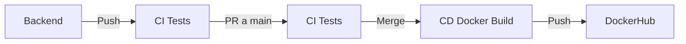

# Construir la imagen
docker build -t webapi:latest .

# Ejecutar con entorno Development (Swagger visible)
docker run -d -p 5000:8080 \
  -e ASPNETCORE_ENVIRONMENT=Development \
  --env-file .env \
  --name webapi-dev \
  webapi:latest
  

# Tener en cuenta. 
Cada push a la rama backend activara el CI para compilar y correr test.
Igual para cada pull resquest desde distintas ramas. 
Ademas de cada cambio a main activa el CD para contruir la imagen de docker. 

## Flujo de CI/CD

### Explicación del flujo:

1. **Trabajas en rama `backend`** 👨‍💻
2. **Push a `backend`** → Se ejecuta **CI** (pruebas: restore → build → test)
3. **Abres PR de `backend` → `main`** → Se ejecuta **CI** nuevamente (pruebas)
4. **Alguien aprueba y hace MERGE a `main`** ✅
5. **Push a `main`** → Se ejecuta **CD** (construir imagen Docker y subir a Docker Hub)
6. **¡Imagen disponible en Docker Hub!** 📦